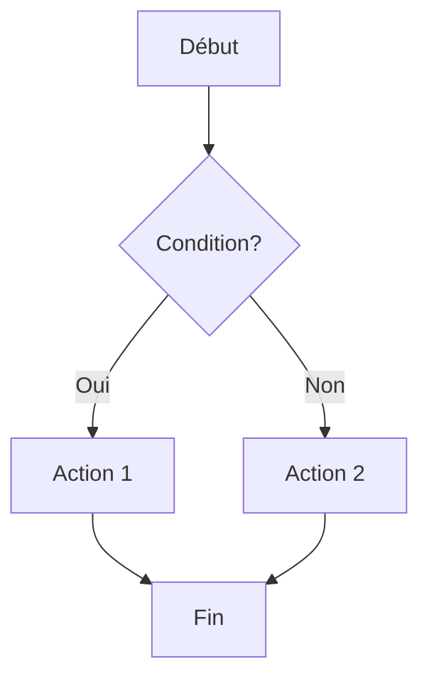

# 📝 Markdown Workstation

> Un éditeur Markdown complet, puissant et élégant directement dans [votre navigateur](https://ouaisfieu.github.io/sam/eatme.html)


---

## ✨ Caractéristiques principales

### 🎨 Interface moderne
- Design **rétro-futuriste** avec thème lilas et vert terminal
- Animations fluides et effets néon
- Interface responsive (desktop, tablette, mobile)
- Effets de scanline et glitch pour l'ambiance cyberpunk

### ✏️ Éditeur puissant
- **Éditeur en temps réel** avec aperçu instantané
- **Coloration syntaxique** pour les blocs de code (140+ langages)
- **Barre d'outils** intuitive avec raccourcis
- **Statistiques en direct** : caractères, mots, lignes

### 📁 Gestion multi-fichiers
- Travaillez sur **plusieurs fichiers** simultanément
- **Drag & Drop** pour charger vos fichiers
- **Indicateur de modifications** (● = fichier modifié)
- **Changement de nom** à la volée
- **Suppression** individuelle des fichiers

### 💾 Export flexible
- **Export .md** : Téléchargez vos fichiers Markdown
- **Export HTML** : Version standalone avec styles intégrés
- **Sauvegarde en mémoire** : Switchez entre fichiers sans perdre vos modifications
- **Auto-save** toutes les 30 secondes

### 👁️ Modes d'affichage
- **Split** : Éditeur + Aperçu côte à côte (par défaut)
- **Edit** : Éditeur seul en plein écran
- **Preview** : Aperçu seul pour vérifier le rendu

### 🎯 Support Markdown complet
- ✅ Titres (H1 à H6)
- ✅ Emphases (gras, italique, barré)
- ✅ Listes (ordonnées, non ordonnées, tâches)
- ✅ Liens et images
- ✅ Blocs de code avec coloration
- ✅ Citations
- ✅ Tableaux
- ✅ HTML inline
- ✅ Diagrammes Mermaid
- ✅ Formules mathématiques (LaTeX)

---

## 🚀 Démarrage rapide

### Installation

Aucune installation requise ! Il suffit d'ouvrir le fichier HTML dans votre navigateur.

```bash
# Clonez le projet
git clone https://github.com/votre-repo/markdown-workstation.git

# Ouvrez le fichier
# Option 1 : Double-clic sur workstation.html
# Option 2 : Serveur local
python -m http.server 8000
# Puis ouvrez http://localhost:8000/workstation.html
```

### Première utilisation

1. **Créer un nouveau fichier** : Cliquez sur "📄 Nouveau"
2. **Charger un fichier** : Glissez-déposez ou cliquez sur "⬆ Charger .md"
3. **Commencer à écrire** : L'aperçu se met à jour en temps réel
4. **Exporter** : Cliquez sur "📥 Export MD" ou "🌐 Export HTML"

---

## ⌨️ Raccourcis clavier

### Fichiers
| Raccourci | Action |
|-----------|--------|
| `Ctrl+S` / `Cmd+S` | Sauvegarder le fichier actuel |
| `Ctrl+N` / `Cmd+N` | Créer un nouveau fichier |
| `Ctrl+E` / `Cmd+E` | Exporter en .md |

### Mise en forme
| Raccourci | Action |
|-----------|--------|
| `Ctrl+B` / `Cmd+B` | **Gras** |
| `Ctrl+I` / `Cmd+I` | *Italique* |
| `Ctrl+K` / `Cmd+K` | [Lien]() |

### Affichage
| Raccourci | Action |
|-----------|--------|
| `Ctrl+1` / `Cmd+1` | Mode Split (éditeur + aperçu) |
| `Ctrl+2` / `Cmd+2` | Mode éditeur seul |
| `Ctrl+3` / `Cmd+3` | Mode aperçu seul |

---

## 🎨 Barre d'outils

La barre d'outils en haut de l'éditeur offre un accès rapide aux fonctionnalités :

### Boutons de formatage rapide
- **H** : Insérer un titre `# `
- **B** : Mettre en **gras** `**texte**`
- **I** : Mettre en *italique* `*texte*`
- **{ }** : Insérer du `code` inline
- **🔗** : Créer un [lien](url)
- **•** : Créer une liste `- `

---

## 📊 Fonctionnalités avancées

### Auto-save
Le workstation sauvegarde automatiquement vos modifications toutes les 30 secondes. Un indicateur (●) apparaît à côté des fichiers modifiés.

### Avertissement avant fermeture
Si vous avez des modifications non sauvegardées, le navigateur vous demandera confirmation avant de fermer l'onglet.

### Support des diagrammes Mermaid

Créez des diagrammes directement dans votre Markdown :

````markdown

````

### Export HTML standalone

L'export HTML génère un fichier autonome avec :
- Tous les styles intégrés
- Design cohérent avec le workstation
- Responsive et prêt à partager
- Aucune dépendance externe

---

## 🔧 Technologies utilisées

- **[Marked.js](https://marked.js.org/)** - Parser Markdown (v11.1.1)
- **[Highlight.js](https://highlightjs.org/)** - Coloration syntaxique (v11.9.0)
- **[Mermaid](https://mermaid.js.org/)** - Diagrammes (v10)
- **Pure CSS** - Design custom sans framework
- **Vanilla JavaScript** - Pas de dépendances lourdes

---

## 💡 Cas d'usage

### Pour les développeurs
- Documentation de projets
- README et wikis
- Notes techniques
- Tutoriels et guides

### Pour les écrivains
- Brouillons d'articles
- Documentation
- Prise de notes structurées
- Export vers blog/CMS

### Pour les étudiants
- Prise de notes de cours
- Rédaction de rapports
- Documentation de projets
- Révisions structurées

### Pour les équipes
- Documentation collaborative (avec export)
- Spécifications techniques
- Procédures et guides
- Partage de connaissances

---

## 🎯 Fonctionnalités futures

- [ ] Mode sombre / clair
- [ ] Recherche et remplacement dans l'éditeur
- [ ] Support de templates prédéfinis
- [ ] Export PDF
- [ ] Synchronisation cloud (optionnelle)
- [ ] Collaboration en temps réel
- [ ] Plugins et extensions
- [ ] Gestion de projets/dossiers
- [ ] Historique des versions
- [ ] Snippets personnalisés

---

## 🤝 Contribution

Les contributions sont les bienvenues ! N'hésitez pas à :

1. Fork le projet
2. Créer une branche (`git checkout -b feature/amelioration`)
3. Commit vos changements (`git commit -m 'Ajout d'une fonctionnalité'`)
4. Push vers la branche (`git push origin feature/amelioration`)
5. Ouvrir une Pull Request

### Guidelines

- Respecter le style de code existant
- Tester vos modifications sur différents navigateurs
- Documenter les nouvelles fonctionnalités
- Garder l'esprit minimaliste et performant

---

## 📝 License

Ce projet est sous licence MIT. Voir le fichier [LICENSE](LICENSE) pour plus de détails.

---

## 🙏 Remerciements

- **Marked.js** pour le parsing Markdown
- **Highlight.js** pour la coloration syntaxique
- **Mermaid** pour les diagrammes
- La communauté Markdown pour les standards

---

## 📞 Support

Si vous rencontrez des problèmes ou avez des questions :

- 🐛 [Ouvrir une issue](https://github.com/votre-repo/markdown-workstation/issues)
- 💬 [Discussions](https://github.com/votre-repo/markdown-workstation/discussions)
- 📧 Email : votre-email@example.com

---

## 🌟 Donnez une étoile !

Si ce projet vous a été utile, n'hésitez pas à lui donner une étoile ⭐ sur GitHub !

---

<div align="center">

**Fait avec ❤️ par [Votre Nom]**

[🌐 Site Web](https://votre-site.com) • [🐦 Twitter](https://twitter.com/votre-compte) • [💼 LinkedIn](https://linkedin.com/in/votre-profil)

</div>

---

## 📸 Screenshots

### Interface principale - Mode Split


### Mode Éditeur seul


### Mode Aperçu seul


### Gestion multi-fichiers


---

## 🔍 FAQ

**Q : Mes fichiers sont-ils stockés quelque part ?**  
R : Non, tout reste dans votre navigateur. Les fichiers ne sont jamais envoyés sur un serveur.

**Q : Puis-je l'utiliser hors ligne ?**  
R : Oui, une fois la page chargée, vous pouvez travailler hors ligne. Seuls les CDN nécessitent une connexion initiale.

**Q : Le workstation fonctionne-t-il sur mobile ?**  
R : Oui, l'interface est responsive et fonctionne sur tablettes et mobiles, bien que l'expérience soit optimale sur desktop.

**Q : Comment sauvegarder définitivement mes fichiers ?**  
R : Utilisez le bouton "📥 Export MD" pour télécharger vos fichiers sur votre ordinateur.

**Q : Puis-je personnaliser les couleurs/thème ?**  
R : Actuellement non, mais c'est prévu dans les prochaines versions !

---

## 🔄 Changelog

### Version 2.0 (Actuelle)
- ✨ Gestion multi-fichiers
- ✨ Export HTML standalone
- ✨ Auto-save toutes les 30 secondes
- ✨ Barre d'outils avec raccourcis de formatage
- ✨ 3 modes d'affichage (Split/Edit/Preview)
- ✨ Support Mermaid pour diagrammes
- ✨ Statistiques en temps réel
- ✨ Drag & Drop de fichiers
- 🐛 Corrections diverses

### Version 1.0
- 🎉 Release initiale
- ✨ Éditeur Markdown basique
- ✨ Aperçu en temps réel
- ✨ Export .md

---

**Version** : 2.0  
**Dernière mise à jour** : Décembre 2024  
**Statut** : Stable ✅


---

## Contact

[Demain](https://dl.ouaisfi.eu/usba/1/2/3/9/9/9/index.html)
